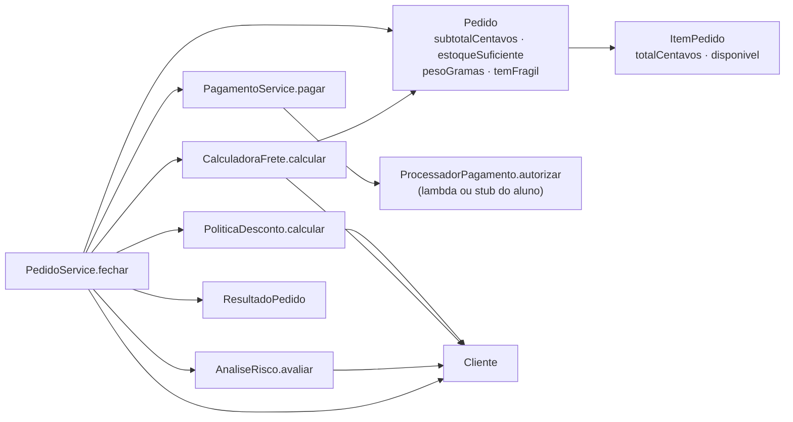
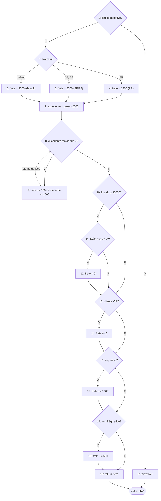
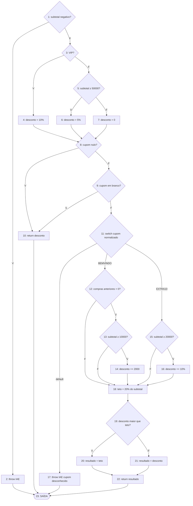
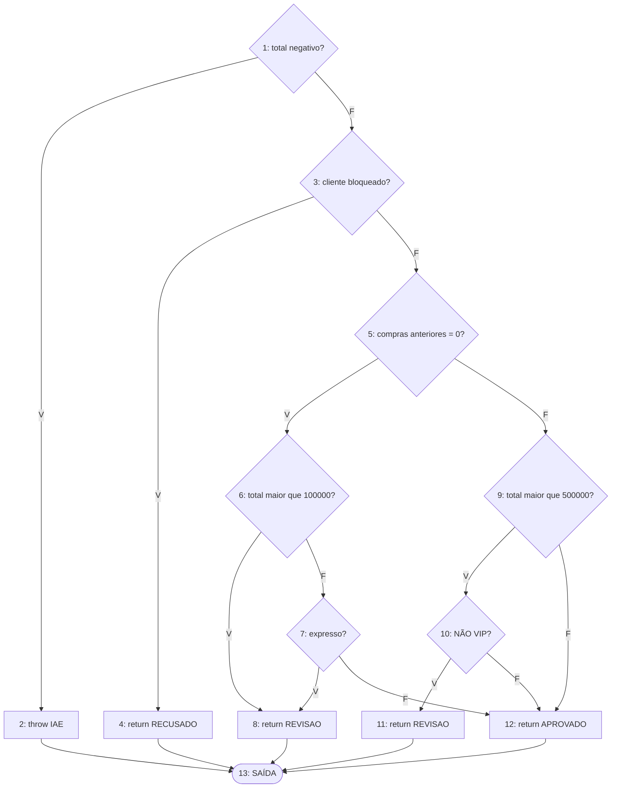
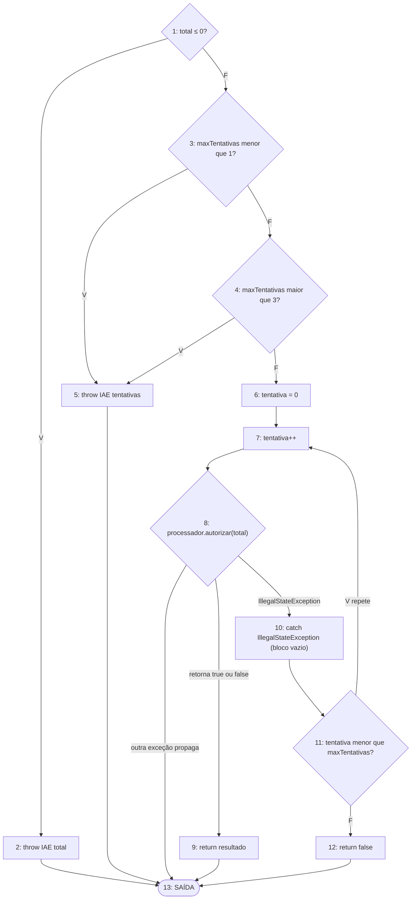
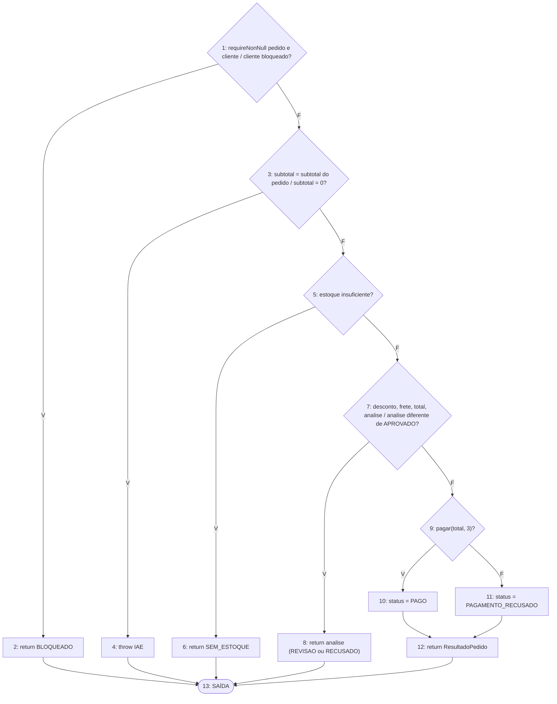

# Relatório do grupo

Integrantes:

> Resultados medidos com JDK 21 compilando com `--release 17`, JUnit Jupiter 5.10.1 (console launcher) e agente JaCoCo 0.8.11. As regras de produção **não foram alteradas**. Rode `mvn clean test` e confira `target/site/jacoco/index.html`: os números devem ser os mesmos (369 testes, 100 % em linhas, ramos, métodos e classes).

## Grafos e complexidade

### Grafo de chamadas de `PedidoService.fechar`

### Modelo adotado (vale para todos os CFGs abaixo)

- Cada condição de `&&` e `||` é um **nó separado** (curto-circuito explícito). Ex.: em `cupom == null || cupom.isBlank()` o segundo operando só é avaliado se o primeiro for falso.
- Todos os `return` e `throw` levam a **um único nó de saída** (grafo conectado, com saída unificada), para que `V(G) = E − N + 2` seja aplicável.
- `switch` com cases agrupados: `case "SP": case "RJ":` conta como **uma** saída. As saídas são PR / SP-RJ / default (3 arestas, contribuindo com 2 decisões). Contando SP e RJ separadamente, `CalculadoraFrete.calcular` iria a V(G) = 11.
- Exceções lançadas por chamadas a colaboradores (`descontos.calcular`, `risco.avaliar`, `requireNonNull` etc.) **não** são arestas do grafo, mas têm testes próprios. A única exceção modelada é a de `PagamentoService.pagar`, porque o `catch` faz parte da lógica (é ele que fecha o laço `do/while`).
- Blocos que terminam em uma decisão são fundidos com a decisão (o nó contém "instruções; condição").

### `CalculadoraFrete.calcular`

`N = 20`, `E = 28`, `V(G) = 28 − 20 + 2 = 10`. Decisões: 1 + 2 (switch) + 1 (while) + 1 + 1 + 1 + 1 + 1 = 9; `9 + 1 = 10` ✓. (JaCoCo informa complexidade 10 para o método.)

### `PoliticaDesconto.calcular`

`N = 23`, `E = 33`, `V(G) = 33 − 23 + 2 = 12`. Decisões: 1+1+1+1+1 + 2 (switch) +1+1+1+1 = 11; `11 + 1 = 12` ✓ (JaCoCo: 12).

### `AnaliseRisco.avaliar`

`N = 13`, `E = 19`, `V(G) = 19 − 13 + 2 = 8`. Decisões: 7; `7 + 1 = 8` ✓ (JaCoCo: 8).

### `PagamentoService.pagar`

`N = 13`, `E = 18`, `V(G) = 18 − 13 + 2 = 7`. Decisões: 4 condições + 2 (o nó 8 tem 3 saídas) = 6; `6 + 1 = 7` ✓.
O JaCoCo informa **5** para o método: ele não conta as arestas de exceção (nós 8→10 e 8→13). Sem a aresta de propagação, o modelo dá 6 (E = 17). A diferença é discutida na análise crítica.

### `PedidoService.fechar`

`N = 13`, `E = 17`, `V(G) = 17 − 13 + 2 = 6`. Decisões: 5; `5 + 1 = 6` ✓ (JaCoCo: `fechar` 6, mais 1 do construtor e 1 de `semCobranca` = 8 na classe).

### Resumo

| Método | Nós | Arestas | V(G) = E − N + 2 | Decisões + 1 | Caminhos independentes (base) | Restrições de viabilidade |
| --- | --- | --- | --- | --- | --- | --- |
| `CalculadoraFrete.calcular` | 20 | 28 | 10 | 10 | 10 (P1–P10 abaixo) | Combinações "nó 10/11" e "nó 15" são correlacionadas: a mesma condição `expresso` é lida duas vezes. 4 das 6 combinações sintáticas são viáveis. |
| `PoliticaDesconto.calcular` | 23 | 33 | 12 | 12 | 12 (P1–P12) | Todos viáveis na unidade. Via serviço, `subtotal < 0` é impossível. |
| `AnaliseRisco.avaliar` | 13 | 19 | 8 | 8 | 8 (P1–P8) | `total < 0` e `bloqueado` são inviáveis via `PedidoService` (ver análise crítica). |
| `PagamentoService.pagar` | 13 | 18 | 7 | 7 | 7 (P1–P7) | Argumentos inválidos são inviáveis via serviço (total ≥ 1 e limite fixo 3). |
| `PedidoService.fechar` | 13 | 17 | 6 | 6 | 6 (P1–P6) | `RECUSADO` da análise de risco nunca chega ao serviço (bloqueado retorna antes). |

## Matriz de testes

Convenção: `P#` é o caminho da base independente do respectivo grafo; "arestas novas" são as que o caminho acrescenta em relação aos anteriores. Os valores esperados foram calculados à mão a partir das regras do README, não pela implementação.

### Base de caminhos — `CalculadoraFrete.calcular` (`CalculadoraFreteTest`)

Cliente comum, entrega normal, sem frágil, peso 1.000 g, líquido 0 e UF PR, salvo indicação.

| ID | Método JUnit | Entrada | Resultado esperado | Caminho / arestas novas | Critério |
| --- | --- | --- | --- | --- | --- |
| CF-P1 | `deveAplicarTarifaBasePorUf` [PR] | base | 1.200 | 1→3→4→7→8→10→13→15→17→19→20 (caminho-base) | caminho básico; laço com 0 iterações |
| CF-P2 | `deveRejeitarValorLiquidoNegativo` | líquido −1 | `IllegalArgumentException` | 1→2, 2→20 | ramo verdadeiro do `if` inicial; exceção |
| CF-P3 | `deveAplicarTarifaBasePorUf` [SP, RJ] | UF SP ou RJ | 2.000 | 3→5, 5→7 | ramo do `switch` |
| CF-P4 | `deveAplicarTarifaBasePorUf` [MG, SC, ZZ, AA] | UF MG | 3.000 | 3→6, 6→7 | `default` do `switch` |
| CF-P5 | `deveAcrescentarTrezentosPorKgAdicionalOuFracao` [2001] | peso 2.001 g | 1.500 | 8→9, 9→8 | laço com 1 iteração (fração de kg) |
| CF-P6 | `deveZerarFreteExatamenteNoLimiar` | líquido 30.000 | 0 | 10→11, 11→12, 12→13 | limite `≥`; frete grátis |
| CF-P7 | `deveAcrescentarQuinzeReaisNoExpresso` | expresso | 2.700 | 15→16, 16→17 | ramo verdadeiro de `expresso` |
| CF-P8 | `naoDeveZerarFreteQuandoEntregaEExpressa` | líquido 30.000 e expresso | 2.700 | 11→13 | `&&` com 2º operando falso (curto-circuito parcial) |
| CF-P9 | `deveCobrarMetadeDoFreteDoParanaParaVip` | VIP | 600 | 13→14, 14→15 | ramo verdadeiro de VIP |
| CF-P10 | `deveAcrescentarCincoReaisQuandoHaItemFragilAtivo` | item frágil ativo | 1.700 | 17→18, 18→19 | ramo verdadeiro de frágil |

Outras famílias de testes desta classe: fronteiras do `while` (peso 1, 1.999, 2.000, 2.001, 2.999, 3.000, 3.001, 4.000, 4.001, 5.000 e 100.000 g → 0, 1, 2, 3 e 98 iterações), fronteiras do frete grátis (29.999 / 30.000 / 1.000.000), frágil cobrado uma vez com várias linhas frágeis, linha inativa ignorada (peso e frágil) e a **tabela completa das 16 combinações** gratuidade × VIP × expresso × frágil (`deveCobrirTodasAsCombinacoesDeGratuidadeVipExpressoEFragil`).

### Base de caminhos — `PoliticaDesconto.calcular` (`PoliticaDescontoTest`)

| ID | Método JUnit | Entrada (cliente, subtotal, cupom) | Resultado esperado | Arestas novas | Critério |
| --- | --- | --- | --- | --- | --- |
| PD-P1 | `deveManterDescontoBaseParaCupomNuloOuBranco` / `deveAceitarSubtotalZeroSemDesconto` | comum novo, 10.000, `null` | 0 | 1→3→5→7→8→10→23 (base) | caminho básico; `cupom == null` verdadeiro (2º operando **não** avaliado) |
| PD-P2 | `deveRejeitarSubtotalNegativo` | comum, −1, `null` | `IllegalArgumentException("Subtotal negativo")` | 1→2, 2→23 | exceção |
| PD-P3 | `deveDar10PorCentoParaClienteVip` | VIP, 10.000, `null` | 1.000 | 3→4, 4→8 | ramo VIP |
| PD-P4 | `deveDar5PorCentoParaClienteComumApenasAPartirDeQuinhentosReais` | comum, 50.000 (e 100.000), `null` | 2.500 (5.000) | 5→6, 6→8 | ramo `≥ 50.000`, no limite |
| PD-P5 | `deveManterDescontoBaseParaCupomNuloOuBranco` | comum, 50.000, `"  "` | 2.500 | 8→9, 9→10 | cupom branco (2º operando avaliado) |
| PD-P6 | `naoDeveSomarBemvindoQuandoJaHouveCompras` | comum antigo, 10.000, `BEMVINDO` | 0 | 9→11, 11→12, 12→18, 18→19, 19→21, 21→22, 22→23 | `&&` com 1º operando falso (2º **não** avaliado) |
| PD-P7 | `naoDeveSomarBemvindoUmCentavoAbaixoDoLimiar` | comum novo, 9.999, `BEMVINDO` | 0 | 12→13, 13→18 | limite 10.000 |
| PD-P8 | `deveSomarVinteReaisComBemvindoAcimaDoLimiar` | comum novo, 15.000, `BEMVINDO` | 2.000 | 13→14, 14→18 | ramo elegível |
| PD-P9 | `naoDeveSomarExtra10UmCentavoAbaixoDoLimiar` | comum, 19.999, `EXTRA10` | 0 | 11→15, 15→18 | limite 20.000 |
| PD-P10 | `deveSomarDezPorCentoComExtra10NoLimiar` | comum, 20.000, `EXTRA10` | 2.000 | 15→16, 16→18 | ramo elegível |
| PD-P11 | `deveRejeitarCupomDesconhecido` | comum antigo, 60.000, `PROMO` | `IllegalArgumentException("Cupom desconhecido")` | 11→17, 17→23 | `default` do `switch` |
| PD-P12 | `deveLimitarAoTetoQuandoVipUsaBemvindoNoLimiar` | VIP novo, 10.000, `BEMVINDO` | 2.000 (1.000 + 2.000 = 3.000, cortado pelo teto de 2.000) | 19→20, 20→22 | teto de 20 % |

Também cobertos: truncamento (`999 → 99`, `50.021 → 2.501`, `20.019 → 2.001`, teto `20.019 → 4.003`), normalização (`" bemvindo "`, `"BemVindo"`, `"\tbemvindo\n"`), independência do idioma da máquina (`tr-TR`) e desconto exatamente igual ao teto (não corta).

### Base de caminhos — `AnaliseRisco.avaliar` (`AnaliseRiscoTest`)

| ID | Método JUnit | Entrada (cliente, total, expresso) | Resultado esperado | Arestas novas | Critério |
| --- | --- | --- | --- | --- | --- |
| AR-P1 | `naoDeveAplicarLimiteDePrimeiraCompraAClienteAntigo` | comum, 1 compra, 100.001, não | `APROVADO` | 1→3, 3→5, 5→9, 9→12, 12→13 (base) | caminho básico |
| AR-P2 | `deveRejeitarTotalNegativo` | comum, 1 compra, −1, não | `IllegalArgumentException` | 1→2, 2→13 | exceção |
| AR-P3 | `deveRecusarClienteBloqueadoComCompras` | bloqueado, 5 compras, 100, não | `RECUSADO` | 3→4, 4→13 | retorno antecipado |
| AR-P4 | `deveEnviarPrimeiraCompraParaRevisaoUmCentavoAcimaDoLimite` | 0 compras, 100.001, não | `REVISAO` | 5→6, 6→8, 8→13 | limite `> 100.000` |
| AR-P5 | `deveEnviarPrimeiraCompraExpressaParaRevisaoMesmoComTotalBaixo` | 0 compras, 1, sim | `REVISAO` | 6→7, 7→8 | `\|\|` com 1º falso e 2º verdadeiro |
| AR-P6 | `deveAprovarPrimeiraCompraComTotalNoLimiteENormal` | 0 compras, 100.000, não | `APROVADO` | 7→12 | limite exato (não é "maior que") |
| AR-P7 | `deveEnviarClienteComumAntigoParaRevisaoUmCentavoAcimaDoLimite` | comum, 1 compra, 500.001, não | `REVISAO` | 9→10, 10→11, 11→13 | limite `> 500.000` |
| AR-P8 | `deveAprovarClienteVipAntigoMesmoAcimaDoLimite` | VIP, 1 compra, 500.001, não | `APROVADO` | 10→12 | `&&` com 2º operando falso |

Também: tabela de decisão com 22 linhas (compras × VIP × expresso × faixa de total) e bloqueado prevalecendo sobre qualquer outra regra.

### Base de caminhos — `PagamentoService.pagar` (`PagamentoServiceTest`)

O stub `ProcessadorRoteirizado` executa um roteiro (`true`, `false` ou uma exceção por chamada) e registra os totais recebidos.

| ID | Método JUnit | Argumentos e roteiro do stub | Resultado esperado | Arestas novas | Critério |
| --- | --- | --- | --- | --- | --- |
| PG-P1 | `deveAprovarNaPrimeiraTentativaEChamarOProcessadorUmaUnicaVez` | (11.200, 3); `[true]` | `true`; chamadas = `[11200]` | 1→3, 3→4, 4→6, 6→7, 7→8, 8→9, 9→13 (base) | caminho básico; `do/while` com 1 passagem |
| PG-P2 | `deveRejeitarTotalNaoPositivo` | (0, 3), (−1, 3) | `IllegalArgumentException`; 0 chamadas | 1→2, 2→13 | validação |
| PG-P3 | `deveRejeitarLimiteDeTentativasForaDeUmATres` [0] | (1.000, 0) | `IllegalArgumentException`; 0 chamadas | 3→5, 5→13 | `\|\|` 1º operando verdadeiro |
| PG-P4 | `deveRejeitarLimiteDeTentativasForaDeUmATres` [4] | (1.000, 4) | `IllegalArgumentException`; 0 chamadas | 4→5 | `\|\|` 2º operando verdadeiro |
| PG-P5 | `deveAprovarNaSegundaTentativaAposUmaIndisponibilidade` | (7.777, 3); `[ISE, true]` | `true`; chamadas = `[7777, 7777]` | 8→10, 10→11, 11→7 | retorno do laço (2ª iteração) |
| PG-P6 | `deveRetornarFalsoAoEsgotarUmaTentativa` | (1.000, 1); `[ISE]` | `false`; 1 chamada | 11→12, 12→13 | saída do laço por esgotamento |
| PG-P7 | `devePropagarExcecaoDiferenteDeIllegalStateNaPrimeiraChamada` | (1.000, 3); `[RuntimeException]` | exceção propagada; 1 chamada | 8→13 | exceção **não** tratada |

Laço com 1, 2 e 3 iterações: `deveRetornarFalsoAoEsgotarUmaTentativa` / `...DuasTentativas` / `...TresTentativas`, `deveAprovarNaSegunda...` e `deveAprovarNaTerceira...`. Limite respeitado mesmo que a chamada seguinte fosse aprovar: `naoDeveExcederOLimite...` e `naoDeveExcederLimiteDeDuasTentativas...`. Recusa (`false`) nunca repete: `naoDeveRepetirQuandoOProcessadorRecusa` [1, 2, 3].

### Base de caminhos — `PedidoService.fechar` (`PedidoServiceTest`)

| ID | Método JUnit | Entrada e estado do stub | Resultado esperado | Arestas novas | Critério |
| --- | --- | --- | --- | --- | --- |
| PS-P1 | `deveFecharPedidoDeClienteComumComFreteDoParanaEPagamentoAprovado` (exemplo) | comum, 1 compra; 1 × R$ 100,00; PR; stub `true` | `PAGO`; 10.000 / 0 / 1.200 / 11.200; cobranças `[11200]` | 1→3, 3→5, 5→7, 7→9, 9→10, 10→12, 12→13 (base) | caminho básico |
| PS-P2 | `deveBloquearClienteBloqueadoSemCobrarNada` | cliente bloqueado | `BLOQUEADO`; tudo zero; 0 cobranças | 1→2, 2→13 | retorno antecipado |
| PS-P3 | `deveRejeitarPedidoSemLinhas` | lista vazia | `IllegalArgumentException`; 0 cobranças | 3→4, 4→13 | exceção |
| PS-P4 | `deveRetornarSemEstoqueQuandoQuantidadeExcedeOEstoque` | quantidade 3, estoque 2 | `SEM_ESTOQUE`; tudo zero; 0 cobranças | 5→6, 6→13 | retorno antecipado |
| PS-P5 | `deveEnviarPrimeiraCompraExpressaParaRevisaoSemCobrar` | 0 compras; expresso; R$ 100,00; PR | `REVISAO`; 10.000 / 0 / 2.700 / 12.700; 0 cobranças | 7→8, 8→13 | retorno antecipado; regra de risco |
| PS-P6 | `deveRetornarPagamentoRecusadoComOsValoresCalculados` | stub `[false]` | `PAGAMENTO_RECUSADO`; valores calculados; cobranças `[11200]` | 9→11, 11→12 | ramo falso do pagamento |

Cenários de colaboração adicionais (valores calculados à mão): VIP + `EXTRA10` batendo no teto e frete grátis (50.000 / 10.000 / 0 / 40.000); comum 5 % com frete grátis (60.000 / 3.000 / 0 / 57.000); MG com excedente de peso (15.000 / 0 / 3.900 / 18.900); VIP + expresso + frágil (10.000 / 1.000 / 2.600 / 11.600); truncamento (12.345 / 1.234 / 600 / 11.711); `BEMVINDO` em 1ª compra; linha inativa ignorada em valor, peso e fragilidade; revisão para comum antigo acima de R$ 5.000 e aprovação do VIP no mesmo pedido; recusa, 1 indisponibilidade, 2 indisponibilidades, esgotamento das 3 tentativas e propagação de exceção inesperada.

### Demais classes (validação e laços)

| Classe de teste | Testes | O que exercita |
| --- | --- | --- |
| `ClienteTest` | 9 | histórico 0 (limite), negativos (−1, −10, `MIN_VALUE`), igualdade do `record` |
| `ItemPedidoTest` | 55 | limites de preço (0/1/1.000.000/1.000.001), quantidade (−1/0/100/101), estoque, peso (0/1/100.000/100.001), SKU nulo/vazio/branco, `totalCentavos` (inclusive 100.000.000 em `long`), `disponivel` (`<`, `=`, `>`) |
| `PedidoTest` | 59 | UF (formato `[A-Z]{2}`), 100 vs. 101 linhas, elemento nulo (`NullPointerException`), cópia defensiva; `for` de `subtotal`, `peso`, `temFragil` e `estoqueSuficiente` com 0, 1 e várias iterações, `continue`, `break` e falta de estoque no início/meio/fim |

## Evolução da cobertura

Cada etapa é cumulativa e inclui o teste de exemplo. Colunas: cobertos/total (percentual).

| Etapa | Testes executados | Linhas | Branches | Métodos | Classes | Lacunas e justificativas |
| --- | --- | --- | --- | --- | --- | --- |
| Inicial | 0 | Não medido | Não medido | Não medido | Não medido | Sem testes |
| E0 — só o exemplo | 1 | 87/108 (80,6 %) | 50/116 (43,1 %) | 20/21 (95,2 %) | 9/9 | Só o caminho feliz: nenhum retorno antecipado, cupom, expresso, VIP, frágil, laço de peso ou repetição de pagamento. `semCobranca` nunca chamado. |
| E1 — + `ClienteTest`, `ItemPedidoTest`, `PedidoTest` | 124 | 89/108 (82,4 %) | 69/116 (59,5 %) | 20/21 (95,2 %) | 9/9 | Validações e laços de `Pedido` cobertos; regras de desconto, frete, risco e pagamento ainda só no caminho feliz. |
| E2 — + `PoliticaDescontoTest`, `CalculadoraFreteTest`, `AnaliseRiscoTest` | 300 | 103/108 (95,4 %) | 106/116 (91,4 %) | 20/21 (95,2 %) | 9/9 | Faltam o `do/while` com 2ª/3ª tentativa, o esgotamento e o `catch` em `PagamentoService`, além dos retornos antecipados de `PedidoService`. |
| E3 — + `PagamentoServiceTest` | 331 | 106/108 (98,1 %) | 111/116 (95,7 %) | 20/21 (95,2 %) | 9/9 | Restam 5 branches e 2 linhas de `PedidoService` (`BLOQUEADO`, `SEM_ESTOQUE`, `REVISAO`, `PAGAMENTO_RECUSADO`) e o método `semCobranca`. |
| E4 — + `PedidoServiceTest` completo (final) | 369 | 108/108 (100 %) | 116/116 (100 %) | 21/21 (100 %) | 9/9 | Nenhuma. `ProcessadorPagamento` é interface sem código e não entra na contagem de classes. |

Resumo final por classe (JaCoCo): `Cliente` 2/2 branches; `ItemPedido` 20/20; `Pedido` 24/24; `PoliticaDesconto` 21/21; `CalculadoraFrete` 17/17; `AnaliseRisco` 14/14; `PagamentoService` 8/8; `PedidoService` 10/10; `ResultadoPedido` sem branches. Total: 637/637 instruções, 116/116 branches, 108/108 linhas, 21/21 métodos, 80/80 de complexidade.

Sobre o significado dos percentuais: **linha** = alguma instrução da linha executou; **branch** = cada saída (verdadeira/falsa, cada `case`) de cada decisão foi tomada; **método** = foi chamado ao menos uma vez; **classe** = ao menos um método executou. 100 % não significa "sem defeitos": só mostra o que foi executado; quem verifica a correção são as asserções.

## Análise crítica

**Quais combinações faltavam mesmo com os ramos cobertos?**
Em `CalculadoraFrete.calcular`, cinco testes bastam para 17/17 branches e 15/15 linhas (verificado com o JaCoCo): PR com líquido negativo, PR simples, SP com 3.001 g + VIP + expresso + frágil + líquido 30.000, MG com líquido 30.000 e RJ simples. Esses cinco percorrem uma fração mínima dos caminhos: só de combinações completas, com no máximo uma iteração do `while`, existem 3 saídas do `switch` × 4 combinações viáveis de gratuidade/expresso × VIP × frágil × 2 = 96 caminhos. Por exemplo, "VIP, entrega normal e frágil" nunca é executado por esses cinco testes. Por isso há a tabela de 16 combinações e a base de 10 caminhos.

**Quais condições não foram avaliadas devido ao curto-circuito?**
`cupom.isBlank()` quando `cupom == null`; `subtotal >= 10_000` quando há compras anteriores; `expresso` (`AnaliseRisco`) quando `total > 100_000`; `!cliente.vip()` quando `total <= 500_000`; `!pedido.expresso()` quando `liquido < 30_000`; `maxTentativas > 3` quando `maxTentativas < 1`. Cada uma foi exercitada nos dois estados do 1º operando (P1/P5, P6/P7, AR-P4/P5, AR-P1/P7, CF-P1/P6, PG-P3/P4). O caso de `total > 100_000 || expresso` mostra o limite da técnica: com `total = 100.001` o efeito de `expresso` é inobservável, pois qualquer valor resulta em `REVISAO`.

**Quais caminhos são inviáveis no serviço, mas viáveis na unidade?**
`AnaliseRisco` retornar `RECUSADO` e lançar por total negativo (o serviço barra o cliente bloqueado antes e `total ≥ 1` sempre); `PoliticaDesconto` com subtotal negativo e `CalculadoraFrete` com líquido negativo (o subtotal é positivo e o desconto é limitado a 20 %, logo líquido ≥ 1); `PagamentoService` com total ≤ 0 ou limite fora de 1–3 (o serviço passa total ≥ 1 e limite fixo 3). Caminhos viáveis nos dois níveis exigem cuidado com a ordem: `BLOQUEADO`, `SEM_ESTOQUE` e subtotal zero têm testes que provam que o cupom inválido **não** chega a ser avaliado.

**Como foram testadas exceções e quantidades de iterações?**
Exceções com `assertThrows` conferindo o tipo e, quando relevante, a mensagem (para provar qual validação disparou primeiro). Nas exceções do processador, o stub roteirizado lança `IllegalStateException` (retentável) ou outra exceção (propagada) e o teste confere o número de chamadas e o total recebido em cada uma. Iterações: `while` do frete com 0, 1, 2, 3 e 98 iterações (kg exato e fração); `do/while` com 1, 2 e 3 passagens; `for` de `Pedido` com lista vazia, 1 linha e várias linhas, com linhas inativas no início, no meio e no fim.

**Um caso em que cobertura de ramos não demonstra cobertura de caminhos.**
O exemplo de `CalculadoraFrete` acima. Os quatro `if` seguintes ao `while` (gratuidade, VIP, expresso, frágil) são independentes; dois testes (tudo falso e tudo verdadeiro) já dão 100 % de ramos deles, mas executam 2 das 16 combinações. Além disso, `expresso` é lido duas vezes (nós 11 e 15), então 2 das 6 combinações sintáticas entre esses nós são **inviáveis**: um caminho "não expresso no nó 11 e expresso no nó 15" não existe.

**Uma exceção não representada no contador de branches.**
Em `PagamentoService.pagar`, propagar uma exceção que não é `IllegalStateException` (aresta 8→13) não vira branch para o JaCoCo. Foi verificado: 7 testes sem nenhum caso de propagação (aprova, recusa, três validações, repete-e-aprova, esgota) produzem 8/8 branches, 11/11 linhas e 2/2 métodos, ou seja, 100 % com a propagação **nunca** testada. Por isso o JaCoCo indica complexidade 5, enquanto o CFG que inclui o `catch` e a propagação dá 7. O teste `devePropagarExcecaoDiferenteDeIllegalStateNaPrimeiraChamada` existe justamente por isso; a mutação M6 abaixo prova que ele é necessário.

**Qual alteração proposital foi detectada por qual teste? A alteração foi desfeita?**
As mutações foram aplicadas numa **cópia temporária** do projeto (o código de produção entregue permaneceu intacto, ou seja, nada precisou ser desfeito). Todas as mutações abaixo foram detectadas, exceto a M12.

| Mutação | Testes que falharam | Detectado por (exemplos) |
| --- | --- | --- |
| M1 `CalculadoraFrete`: `liquido >= 30_000` → `> 30_000` | 9 | `deveZerarFreteExatamenteNoLimiar`, `deveCobrirTodasAsCombinacoes...` |
| M2 `PoliticaDesconto`: `subtotal >= 50_000` → `> 50_000` | 10 | `deveDar5PorCentoParaClienteComumApenasAPartirDeQuinhentosReais` |
| M3 `PoliticaDesconto`: teto de 20 % removido | 2 | `deveLimitarAoTetoQuandoVipUsaBemvindoNoLimiar`, `deveLimitarAoTetoComValorTruncado` |
| M4 `AnaliseRisco`: `\|\|` → `&&` | 12 | `deveEnviarPrimeiraCompraExpressaParaRevisaoMesmoComTotalBaixo` |
| M5 `PagamentoService`: `<` → `<=` | 6 | `deveRetornarFalsoAoEsgotarUmaTentativa` (e Duas/Tres) |
| M6 `PagamentoService`: `catch (RuntimeException)` | 4 | `devePropagarExcecaoDiferenteDeIllegalStateNaPrimeiraChamada` |
| M7 `PedidoService`: sem checagem de bloqueado | 4 | `deveBloquearClienteBloqueadoSemCobrarNada`, `deveBloquearAntesDeVerificarEstoque` |
| M8 `CalculadoraFrete`: 300 → 200 por kg | 14 | `deveAcrescentarTrezentosPorKgAdicionalOuFracao` |
| M9 `ItemPedido`: `quantidade > 100` → `>= 100` | 6 | `deveAceitarQuantidadeDentroDoIntervalo` [100] |
| M10 `Pedido.temFragil`: ignora a quantidade | 3 | `naoDeveContarFragilDeLinhaInativa` |
| M11 `PoliticaDesconto`: `Locale.ROOT` → `tr-TR` | 5 | `deveNormalizarCupomIndependenteDoIdiomaPadraoDaMaquina` |
| M12 `Pedido.estoqueSuficiente`: remoção do `break` | 0 | **Mutante equivalente**: `suficiente` só muda de `true` para `false`, então o resultado é idêntico; o `break` é só otimização. Não é falha da suíte. |
| M13 `PedidoService`: `total = liquido` (sem frete) | 16 | `deveCobrarFreteBaseMaisExcedenteDePesoForaDoParana` |
| M14 `CalculadoraFrete`: VIP paga 1/3 | 14 | `deveCobrarMetadeDoFreteDoParanaParaVip` |

Discussão: M6 é o caso que a cobertura sozinha não pegaria; M11 só é pega por um teste que troca o `Locale` padrão; M12 mostra que nem todo mutante sobrevivente é uma lacuna.
